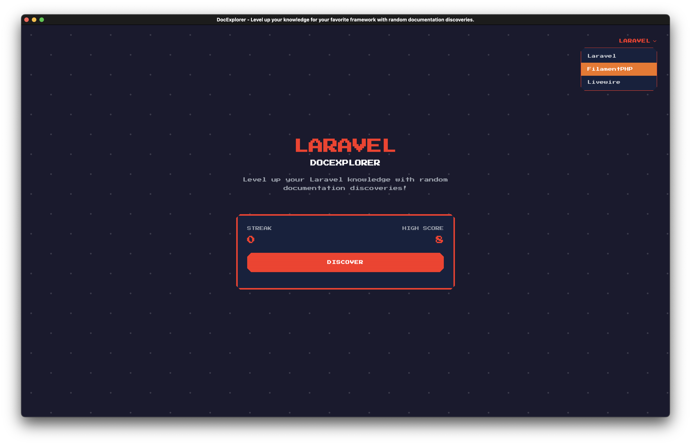

# DocExplorer



## Introduction

**DocExplorer** helps you discover random documentation pages from your favorite framework. Click a button, get a random page. It's a simple way to explore documentation you might not have found otherwise.

### Project Specifications

- Laravel 12
- Livewire 3
- PestPHP 3
- PHP 8.4

## Goal

- Make framework documentation exploration fun and engaging
- Help developers discover new features and best practices
- Create a community-driven learning platform
- Support continuous learning and skill development
- Build a welcoming community of contributors
- Encourage knowledge sharing and collaboration
- Foster an inclusive environment for learning and growth
- Create opportunities for developers to improve their skills through real-world contributions
- Build a sustainable open-source project that benefits the entire developer community

## Getting Started

### Installation

1. Clone the repository:

```bash
git clone https://github.com/codewithdennis/docexplorer.git
cd docexplorer/
```

2. Install dependencies:

```bash
composer install
npm install
npm run build
```

3. Set up environment:

```bash
cp .env.example .env
php artisan key:generate
```

4. Configure your database in `.env`

5. Run migrations and seeder:

```bash
php artisan migrate
php artisan db:seed
```

6. Start the development server:

```bash
php artisan serve
npm run dev
```

## Testing

The project uses Pest PHP for testing. Run tests with:

```bash
php artisan test
```

## Contributing

To contribute to the project:

1. Fork the repository
2. Create your feature branch (`git checkout -b feature/amazing-feature`)
3. Commit your changes (`git commit -m 'Add some amazing feature'`)
4. Push to the branch (`git push origin feature/amazing-feature`)
5. Open a Pull Request

### Contribution Guidelines

- Follow PSR-12 coding standards
- Write tests for new features
    - If you're unfamiliar with testing or need help, you can create a draft PR and ask for assistance from the community.
- Update documentation as needed
- Use meaningful commit messages
- Keep PRs focused and manageable
- Consider adding support for new frameworks

## License

This project is open-sourced under the [MIT license](https://opensource.org/licenses/MIT).

## Acknowledgments

- [Laravel](https://laravel.com) - The PHP framework
- [Livewire](https://livewire.laravel.com) - Full-stack framework for Laravel
- [FilamentPHP](https://filamentphp.com) - Admin panel framework
- All contributors and supporters
